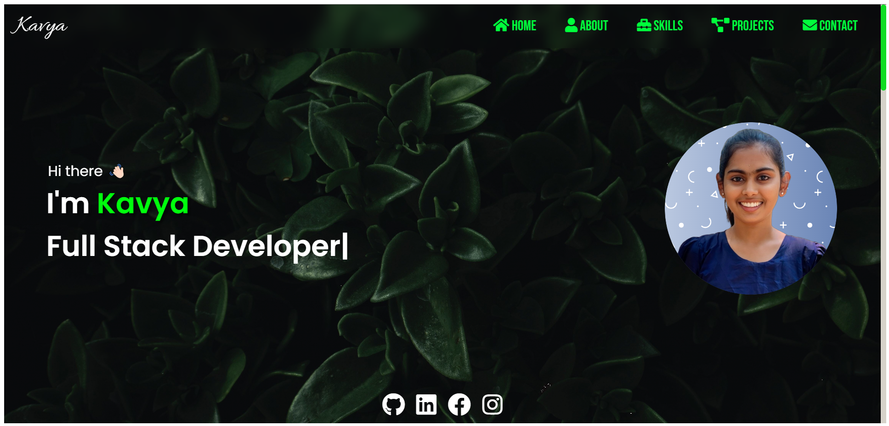
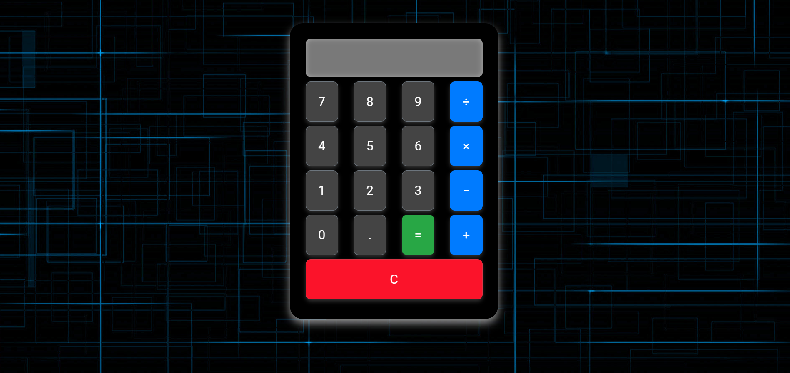

Certainly! Here's the Markdown code for your README.md file:

```markdown
# CodSoft Web Development Internship Tasks

Welcome to my repository showcasing solutions to the tasks I completed during my web development internship at CodSoft. Below, you'll find detailed descriptions and screenshots of each task.

## Tasks

### Task 1: Portfolio Website



**Description:** For this task, I created a portfolio website to highlight my skills and projects. Utilizing HTML5, CSS3, Bootstrap, and JavaScript, I ensured a visually appealing and interactive experience for visitors.

### Task 2: Landing Page


**Description:** The task involved designing a captivating landing page for a product or service. By leveraging HTML5, CSS3, Bootstrap, and JavaScript, I crafted an engaging layout with interactive elements to enhance user experience and navigation.

### Task 3: Calculator Web Application



**Description:** I developed a calculator web application capable of performing basic arithmetic operations. Using HTML5, CSS3, JavaScript, and ReactJS, I created a user-friendly interface with dynamic updating for efficient calculations.

## Internship Experience

During my internship at CodSoft, I immersed myself in various aspects of web development, leading to significant growth and learning opportunities. Here are the key highlights of my experience:

- **Learning Journey:** I gained proficiency in front-end technologies such as HTML, CSS, and JavaScript, enabling me to create responsive and interactive web interfaces.

- **Project Challenges:** Overcoming challenges in debugging, performance optimization, and cross-browser compatibility sharpened my problem-solving skills and enriched my development experience.

- **Collaborative Environment:** Working alongside experienced developers fostered effective communication skills and provided insights into industry best practices.

- **Achievements:** Successfully completing the assigned tasks demonstrated my creativity, attention to detail, and technical expertise in web development.

- **Future Goals:** Inspired by my internship experience, I aspire to explore back-end technologies and frameworks like React and Angular, with the aim of building more dynamic and scalable web applications.

Thank you for visiting my repository! If you have any questions
```